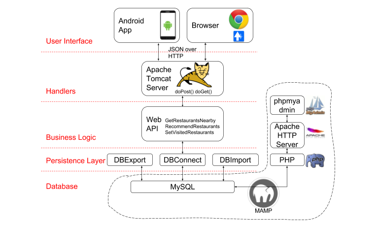
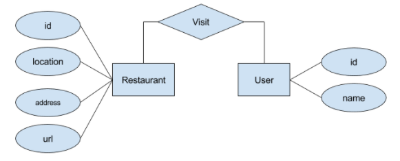

# Dashi
Dashi is a web application which allows users to search restaurants nearby, update preference and view recommended restaurants. The initial thoughts on developing this application is to use personalization to improve restaurant search and recommendation.

## Deployment on AWS
### Step 1. Launch an instance (Ubuntu linux) on EC2
### Step 2. Connect to the instance
For Mac:
1. Download the key
2. Open your terminal, run:

  `chmod 600 ~/Downloads/[YOUR_KEY_NAME].pem` 

  `ssh -i ~/Downloads/[YOUR_KEY_NAME].pem ubuntu@YOUR_INSTANCE_IP`

For Windows:
1. Download Putty and Puttygen from
[a link](https://the.earth.li/~sgtatham/putty/latest/x86/putty.zip)
2. "Conversions"->"Import key", select [YOUR_KEY_NAME].pem file, Save private key as [YOUR_KEY_NAME].ppk
3. Open Putty, enter host ip, in SSH->Auth, choose your ppk file
4. Click Open, enter the username ubuntu
### Step 3. Install Java
In your instance's terminal, execute the following commands:

  `sudo add-apt-repository ppa:webupd8team/java` 

  `sudo apt-get update` 

  `sudo apt-get install oracle-java8-installer` 

### Step 4. Install MySQL
1. In your instance's terminal, execute:

  `sudo apt-get install mysql-server`

When you are asked for new mysql password, use "root".  

  `mysql -u root -p`  

Then input the password "root"

2. In the mysql shell, paste the following SQL statements to install the tables:

  DROP DATABASE IF EXISTS laiproject;
  
  CREATE DATABASE laiproject;
  
  USE laiproject;
  
  CREATE TABLE restaurants (business_id VARCHAR(255) NOT NULL, name VARCHAR(255), 
                              categories VARCHAR(255), city VARCHAR(255), state VARCHAR(255), 
                              stars FLOAT, full_address VARCHAR(255), latitude FLOAT, longitude FLOAT, 
                              image_url VARCHAR(255), url VARCHAR(255), PRIMARY KEY ( business_id )); 
                              
  CREATE TABLE users (user_id VARCHAR(255) NOT NULL, password VARCHAR(255) NOT NULL, first_name VARCHAR(255), 
                          last_name VARCHAR(255), PRIMARY KEY ( user_id )); 
                          
  CREATE TABLE history (visit_history_id bigint(20) unsigned NOT NULL AUTO_INCREMENT, user_id VARCHAR(255) NOT NULL , 
                          business_id VARCHAR(255) NOT NULL, last_visited_time timestamp NOT NULL DEFAULT CURRENT_TIMESTAMP, 
                          PRIMARY KEY (visit_history_id), FOREIGN KEY (business_id) REFERENCES restaurants(business_id), 
                          FOREIGN KEY (user_id) REFERENCES users(user_id)); 
                          
  INSERT INTO users VALUES ("1111", "3229c1097c00d497a0fd282d586be050", "John", "Smith"); 

### Step 4. Install Tomcat 9
1. SSH into your instance
2. Execute the following commands:

`cd /opt/`

`sudo wget http://mirrors.ocf.berkeley.edu/apache/tomcat/tomcat-9/v9.0.0.M21/bin/apache-tomcat-9.0.0.M21.tar.gz`

`sudo tar xzf apache-tomcat-9.0.0.M21.tar.gz`

`sudo ln -s apache-tomcat-9.0.0.M21 tomcat`

`echo "export CATALINA_HOME=\"/opt/tomcat\"" >> ~/.bashrc`

`source ~/.bashrc`

`cd /opt/tomcat`

`sudo ./bin/startup.sh`

### Step 5. Run Dashi on EC2
1. In your local terminal, execute:

`git clone git@github.com:songhm3/Dashi.git Dashi`

`cd Dashi`

`jar -cvf dashi.war *`

For Mac:

`scp -i ~/Downloads/[YOUR_KEY_NAME].pem  Dashi.war ubuntu@YOUR_INSTANCE_IP:~/`

For Windows: use [WinSCP](https://winscp.net/download/WinSCP-5.9.4-Setup.exe)

2. In your Instance's terminal, execute:

`sudo cp ~/Dashi.war /opt/tomcat/webapps/

Now you can verify the server on your browser: http://YOUR_INSTANCE_IP:8080/Dashi/

## Links
[Web Site](http://34.211.73.36/Dashi/)

## Architecture

## ER Model

